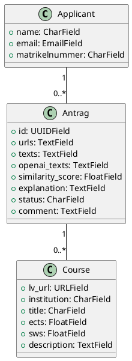
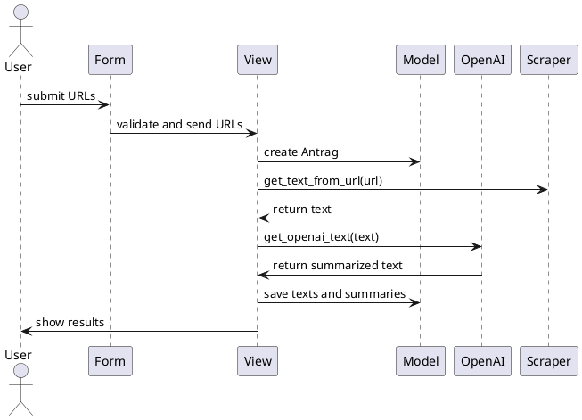

 . .

CMD ["gunicorn", "--bind", ":8000", "myproject.wsgi:application"]
```

**docker-compose.yml**

```yaml
version: '3.7'

services:
  db:
    image: postgres
    environment:
      POSTGRES_DB: mydatabase
      POSTGRES_USER: myuser
      POSTGRES_PASSWORD: mypassword
    volumes:
      - postgres_data:/var/lib/postgresql/data

  web:
    build: .
    command: bash -c "python manage.py migrate && python manage.py runserver 0.0.0.0:8000"
    volumes:
      - .:/app
    ports:
      - "8000:8000"
    environment:
      SCRAPERAPI_KEY: your_scraperapi_key
      OPENAI_API_KEY: your_openai_api_key
      DATABASE_URL: postgres://myuser:mypassword@db:5432/mydatabase
    depends_on:
      - db

volumes:
  postgres_data:
```

#### Kubernetes Deployment and Service

**deployment.yaml**

```yaml
apiVersion: apps/v1
kind: Deployment
metadata:
  name: django-deployment
spec:
  replicas: 3
  selector:
    matchLabels:
      app: django
  template:
    metadata:
      labels:
        app: django
    spec:
      containers:
      - name: django
        image: your_docker_image
        ports:
        - containerPort: 8000
        env:
        - name: SCRAPERAPI_KEY
          valueFrom:
            secretKeyRef:
              name: scraperapi-secret
              key: SCRAPERAPI_KEY
        - name: OPENAI_API_KEY
          valueFrom:
            secretKeyRef:
              name: openai-secret
              key: OPENAI_API_KEY
```

**service.yaml**

```yaml
apiVersion: v1
kind: Service
metadata:
  name: django-service
spec:
  selector:
    app: django
  ports:
    - protocol: TCP
      port: 80
      targetPort: 8000
  type: LoadBalancer
```

**ingress.yaml**

```yaml
apiVersion: networking.k8s.io/v1
kind: Ingress
metadata:
  name: django-ingress
  annotations:
    nginx.ingress.kubernetes.io/rewrite-target: /
spec:
  rules:
  - host: syllabusmatcherai.its.ingress.wu.ac.at
    http:
      paths:
      - path: /
        pathType: Prefix
        backend:
          service:
            name: django-service
            port:
              number: 80
```

### Start Script

**start.sh**

```bash
#!/bin/bash
python manage.py test website_api
python manage.py migrate
python manage.py runserver 0.0.0.0:8000
```

### UML Diagrams Code

**Class Diagram**



**Sequence Diagram**



### Testing and Improvements

Run and test the code as specified. If you encounter any issues or have suggestions for improvements, please share them for further refinement.

 . .

CMD ["gunicorn", "--bind", ":8000", "myproject.wsgi:application"]
```

**docker-compose.yml**

```yaml
version: '3.7'

services:
  db:
    image: postgres
    environment:
      POSTGRES_DB: mydatabase
      POSTGRES_USER: myuser
      POSTGRES_PASSWORD: mypassword
    volumes:
      - postgres_data:/var/lib/postgresql/data

  web:
    build: .
    command: bash -c "python manage.py migrate && python manage.py runserver 0.0.0.0:8000"
    volumes:
      - .:/app
    ports:
      - "8000:8000"
    environment:
      SCRAPERAPI_KEY: your_scraperapi_key
      OPENAI_API_KEY: your_openai_api_key
      DATABASE_URL: postgres://myuser:mypassword@db:5432/mydatabase
    depends_on:
      - db

volumes:
  postgres_data:
```

#### Kubernetes Deployment and Service

**deployment.yaml**

```yaml
apiVersion: apps/v1
kind: Deployment
metadata:
  name: django-deployment
spec:
  replicas: 3
  selector:
    matchLabels:
      app: django
  template:
    metadata:
      labels:
        app: django
    spec:
      containers:
      - name: django
        image: your_docker_image
        ports:
        - containerPort: 8000
        env:
        - name: SCRAPERAPI_KEY
          valueFrom:
            secretKeyRef:
              name: scraperapi-secret
              key: SCRAPERAPI_KEY
        - name: OPENAI_API_KEY
          valueFrom:
            secretKeyRef:
              name: openai-secret
              key: OPENAI_API_KEY
```

**service.yaml**

```yaml
apiVersion: v1
kind: Service
metadata:
  name: django-service
spec:
  selector:
    app: django
  ports:
    - protocol: TCP
      port: 80
      targetPort: 8000
  type: LoadBalancer
```

**ingress.yaml**

```yaml
apiVersion: networking.k8s.io/v1
kind: Ingress
metadata:
  name: django-ingress
  annotations:
    nginx.ingress.kubernetes.io/rewrite-target: /
spec:
  rules:
  - host: syllabusmatcherai.its.ingress.wu.ac.at
    http:
      paths:
      - path: /
        pathType: Prefix
        backend:
          service:
            name: django-service
            port:
              number: 80
```

### Start Script

**start.sh**

```bash
#!/bin/bash
python manage.py test website_api
python manage.py migrate
python manage.py runserver 0.0.0.0:8000
```

### UML Diagrams Code

**Class Diagram**


**Sequence Diagram**


### Testing and Improvements

Run and test the code as specified. If you encounter any issues or have suggestions for improvements, please share them for further refinement.