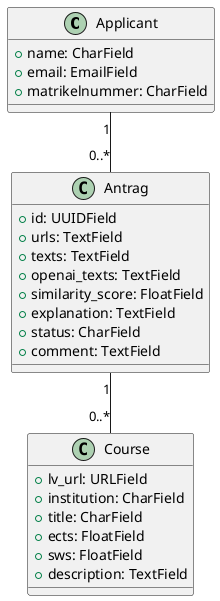
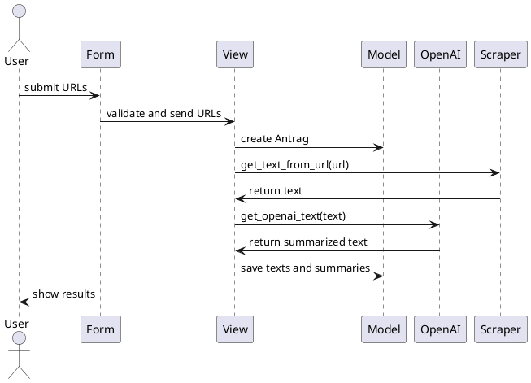

# SyllabusAI
Prototype for AI-based academic accreditation system

### UML Diagrams Code

**Class Diagram**

```plantuml
@startuml
class Applicant {
  +name: CharField
  +email: EmailField
  +matrikelnummer: CharField
}

class Course {
  +lv_url: URLField
  +institution: CharField
  +title: CharField
  +ects: FloatField
  +sws: FloatField
  +description: TextField
}

class Antrag {
  +id: UUIDField
  +urls: TextField
  +texts: TextField
  +openai_texts: TextField
  +similarity_score: FloatField
  +explanation: TextField
  +status: CharField
  +comment: TextField
}

Applicant "1" -- "0..*" Antrag
Antrag "1" -- "0..*" Course
@enduml
```

**Sequence Diagram**

```plantuml
@startuml
actor User
participant Form
participant View
participant Model
participant OpenAI
participant Scraper

User -> Form: submit URLs
Form -> View: validate and send URLs
View -> Model: create Antrag
View -> Scraper: get_text_from_url(url)
Scraper -> View: return text
View -> OpenAI: get_openai_text(text)
OpenAI -> View: return summarized text
View -> Model: save texts and summaries
View -> User: show results
@enduml
```
